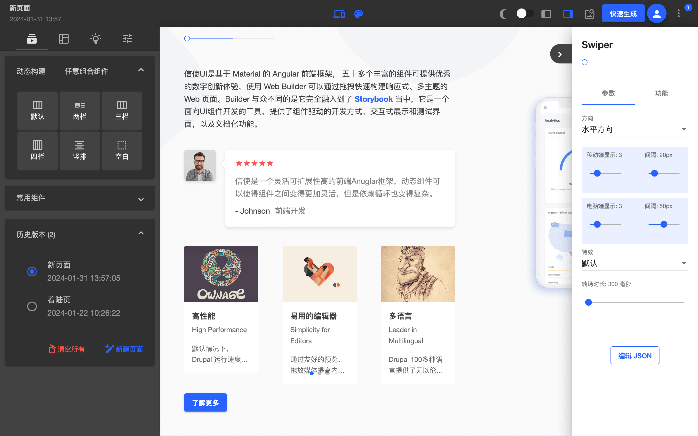
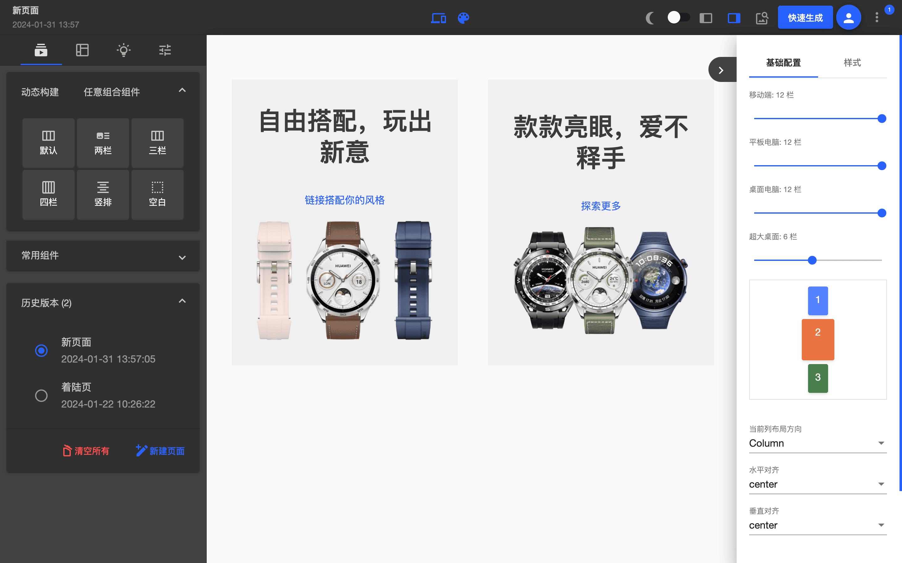
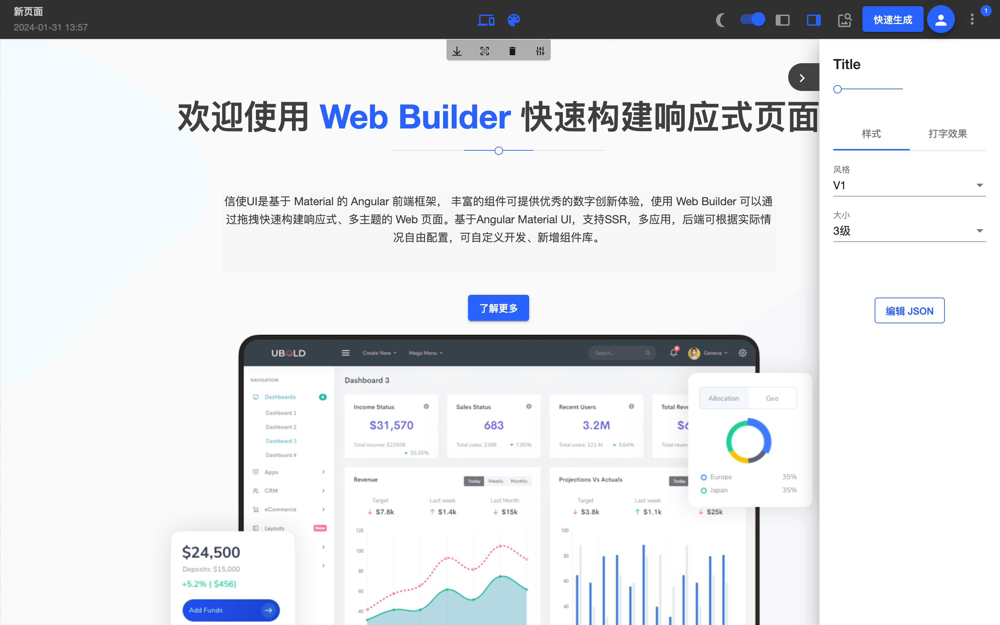
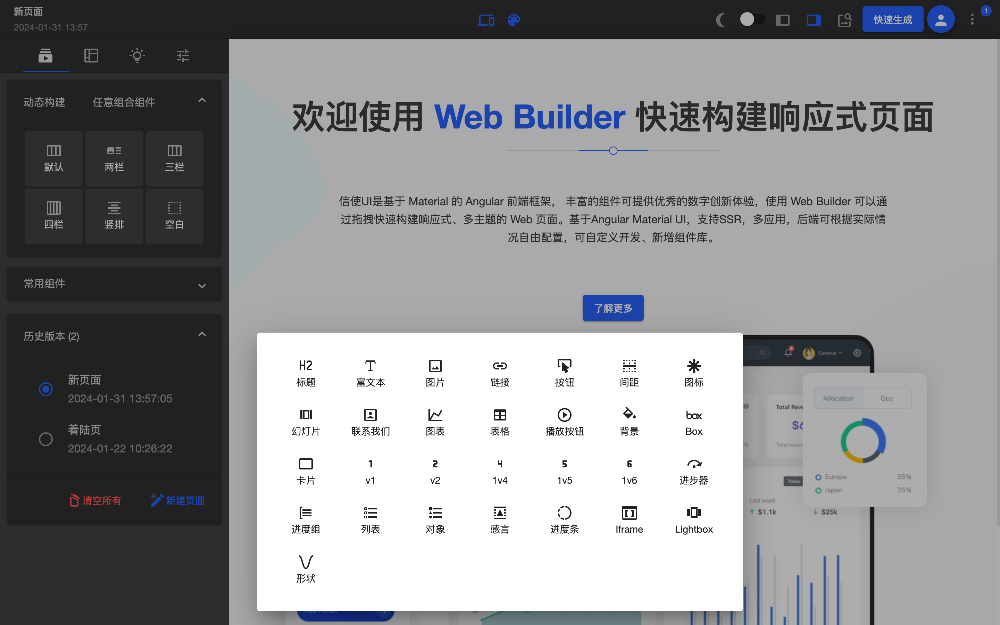
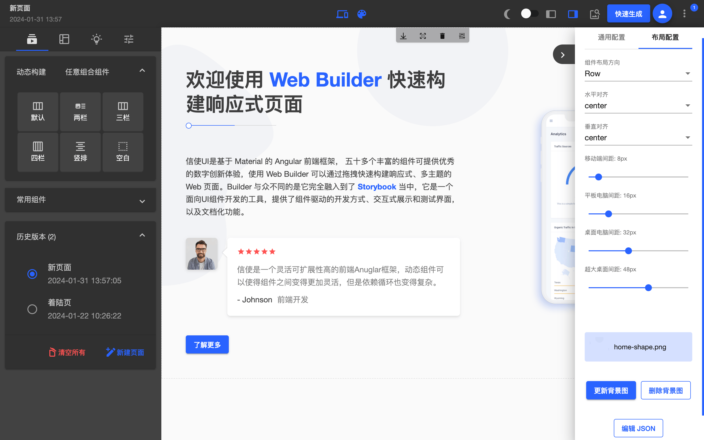
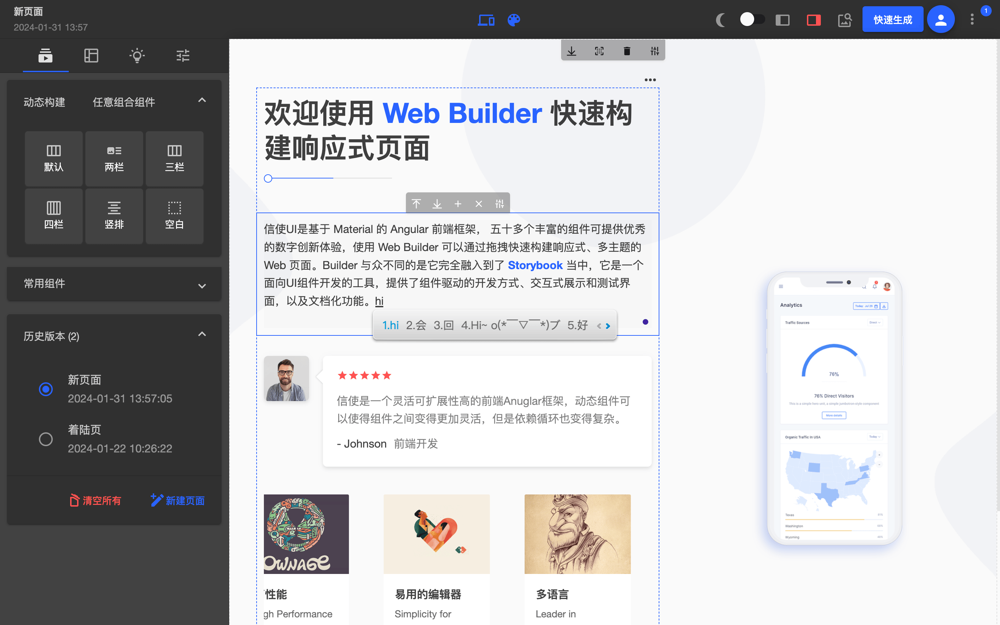
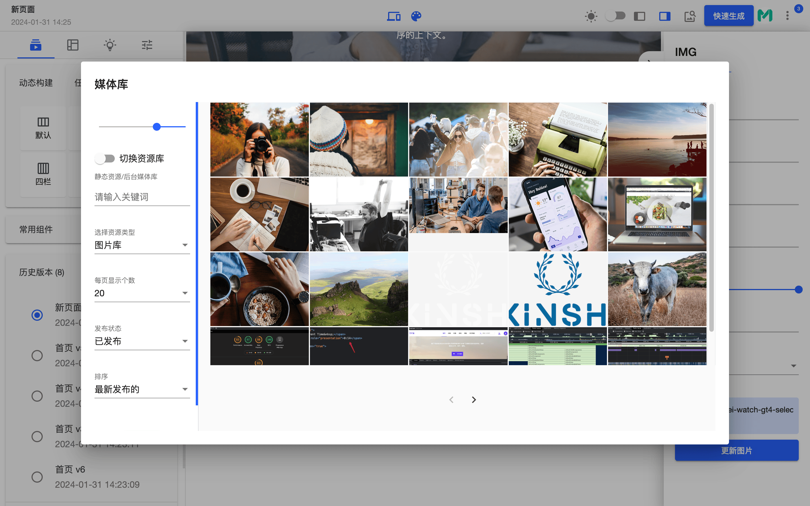

<h1 align="center">信使 Web builder 低代码前端框架</h1>

<p align="center">
  
  <br>
  <i>信使 Web builder 是基于 Material 的 Angular 低代码前端框架，丰富的组件库可提供优秀的数字创新体验，<br>通过拖拽快速构建响应式、多主题、多语言的 Web 页面。
    </i>
  <br>
</p>

<p align="center">
  <a href="https://builder.design"><strong>https://builder.design</strong></a>
  <br>
</p>

<p align="center">
  <a href="https://builder.design/builder">Web Builder </a>
  ·
  <a href="https://ui.builder.design"> UI Storybook </a>
  ·
  <a href="https://www.zhihu.com/people/biaogebusy"> 知乎 </a>
   ·
  <a href="./README-EN.md"> English</a>
  <br>
  <br>
  <a href="https://www.bilibili.com/video/BV1ux4y197kc/?vd_source=f65b4e2d70ecc450290b6b1710c0ada5#reply998790468">观看演示视频</a>
</p>

<p align="center">
  
  <br>
  <br>
</p>

> 奥陌陌是已知的第一颗经过太阳系的星际天体，意为"远方信使"。

#### 开源目的

项目非常适合初学者学习或者进阶，它涵盖了绝大部分 Angular 技术知识点，但并不仅限于以下内容。

- 服务端渲染（SSR）
- 懒加载，Inject 依赖注入
- 路由守卫
- 请求拦截缓存
- 动态组件
- 动态表单
- 动态表格
- 多主题
- 自定义指令
- 自定义管道 pipe
- 自定义 icon
- 数据图表
- Rxjs
- flex layout
- Storybook
- Typescript
- Provider
- 地图应用
- 分析：谷歌分析、微软 Clarity
- 信使 UI 在 Drupal 前后端分离中的应用

## 技术选型

- 前端：Angular + Material + FlexLayout + TailwindCss
- 动态表单：ngx-formly
- web 动画：gsap
- 图表：Echarts
- 视频：Video.js
- 文件生成：jspdf 生成 pdf，html2canvas 生成图像，file-saver 下载文件，jszip 压缩文件
- 编辑器：quill, ang-jsoneditor, vs monaco-editor
- 幻灯片：swiper
- 字体图标：material design icons + 自定义 svg icon
- 加密：crypto-js
- 工具函数：lodash-es
- 测试预览：storybook
- web 服务：Nginx
- 后端：Drupal(推荐)，通过 Drupal 的 views 视图可灵活配置动态组件、动态 api；

## web builder

| 功能点              | 说明                                                                  |
| ------------------- | --------------------------------------------------------------------- |
| Layout builder      | 动态 layout，基于 TailwindCss 的动态组件，支持静态数据和 API 数据来源 |
| 组件编辑            | 删除、复制 JSON、编辑组件数据、拖动上下排列                           |
| 媒体库浏览          | 查看后台上传的媒体资源文件                                            |
| 边栏可拖拽          | 直接从边栏选择组件放入内容区                                          |
| 页面历史版本        | 当提交、清空、加载示例等覆盖操作时新增历史版本                        |
| 选择示例页加载      | 加载示例页面到内容区                                                  |
| 复制整个页面的 JSON | 可直接复制 json，部署到后台发布                                       |
| 切换全宽            | 方便大屏编辑，减少干扰                                                |
| 快速生成页面        | 根据一定的规则从组件库中生成页面                                      |
| 多主题切换预览      | 预览在多主题下的组件显示情况                                          |
| Builder 暗黑风格    | 支持切换浅色风格和暗黑风格，专注内容创作                              |
| 内容区组件导航      | 边栏可通过导航查看组件，可上下拖动排序                                |
| 页面预览            | 调转到新窗口查看真实的页面                                            |
| 响应式预览          | 可切换不同设备尺寸查看页面响应式排版                                  |

## 相关视频演示

- [Layout 嵌套](https://www.bilibili.com/video/BV1pH4y1L7qk/?vd_source=f65b4e2d70ecc450290b6b1710c0ada5)
- [GSAP 动画配置](https://www.bilibili.com/video/BV17F4m157uP/?spm_id_from=pageDriver&vd_source=f65b4e2d70ecc450290b6b1710c0ada5)
- TailwindCss 自定义组件[API 数据来源](https://www.bilibili.com/video/BV1ux4y1n7MA/?spm_id_from=333.999.0.0) | [静态数据来源](https://www.bilibili.com/video/BV1rf421R7He/?spm_id_from=333.999.0.0)
- [复制功能快速构建组件](https://www.bilibili.com/video/BV1nF4m1w7cs/?spm_id_from=333.999.0.0)

## 对应版本

| Web builder | Angular | Node |
| :---------- | :------ | :--- |
| v8          | v17     | v18+ |
| v7          | v16     | v16+ |
| v6          | v14     | v14  |
| v5          | v12     | v14  |
| <=v4        | v11     | v14  |

## 开发指南

## 安装 npm install

1. 代码下载或者 clone 项目到本地：`git clone git@github.com:biaogebusy/web-builder.git`
2. 请使用 npm install 安装，严格安装 package-lock.json 锁版本安装，依赖较多，请多等待，使用 yarn 或者 pnpm 会有报错；

## 本地开发

`npm start`

## 开发环境设置

```javascript
// src/environments/environment.ts
export const environment: IEnvironment = {
  apiUrl: "http://localhost:4200",
  production: false,
  site: "dist",
  port: 4200,
  cache: false,
  ssr: false,
  drupalProxy: false,
};
```

- apiUrl: 是整个应用的 Base api 参数；
- production: 为 false 时，页面的内容 api 将调用本地 json 文件，true 时将会调用`${this.apiUrl}/api/v1/landingPage?content=${this.pageUrl}`接口；
- site: prod 打包时生成的文件夹名称，此设置是为了区分多个 app 项目；
- port: 自定义应用端口；
- cache: 是否开启 api 请求缓存；
- ssr: 是否使用 SSR 服务端渲染方式；
- drupalProxy: 对应后端为 drupal，统一使用 Drupal 来登录登出；

## 路由守卫配置

默认会读取 `/api/v1/config` 的全局配置信息，这里主要是查看该站点是否是开放还是需要登录的，文件路径`src/app/core/guards/auth.guard.ts`，本地开发时可注释掉大概 35 行`reture true;`；

## 配置代理

如果你的应用需要调用后台接口，可以配置代理访问，配置文件`config/proxy.config.js`，本地开发时，会根据对应的 api url 前缀进行代理转发，根据实际情况进行配置；

```javascript
const PROXY_CONFIG = [
  {
    context: ["/api", "/user", "/sites"],
    target: "https://yourdomain.com",
    secure: false,
    changeOrigin: true,
  },
];

module.exports = PROXY_CONFIG;
```

## 页面数据加载逻辑

页面在浏览器打开访问时，应用会订阅 url 的变化，根据`url`进行接口的数据读取，根据接口返回的数据渲染页面组件，本地环境和生产环境返回做了判断：

```js
export function pageContentFactory(
  activateRoute: ActivatedRoute,
  contentService: ContentService,
  contentState: ContentState
): Observable<IPage | object | boolean> {
  const $pageContent =
    (new BehaviorSubject() < IPage) | object | (boolean > false);
  activateRoute.url.subscribe(async (url) => {
    const page = await contentService.loadPageContent().toPromise();
    $pageContent.next(page);
    contentState.pageConfig$.next(page.config);
  });
  return $pageContent;
}
```

```js
loadPageContent(pageUrl = this.pageUrl): Observable<IPage> {
    if (environment.production) {
      const landingPath = '/api/v1/landingPage?content=';
      const pageUrlParams = `${this.apiUrl}${landingPath}${pageUrl}`;
      return this.http.get<any>(pageUrlParams).pipe(
        tap((page) => {
          this.updatePage(page);
          this.logContent(pageUrl);
        }),
        catchError(() => {
          return this.http.get<any>(`${this.apiUrl}${landingPath}404`);
        })
      );
    } else {
      const sample = pageUrl.split('/')[1];
      const samplePage = samples.elements.filter(
        (item) => item.id === sample
      )[0];
      if (samplePage) {
        this.updatePage(samplePage.page);
        return of(samplePage.page);
      } else {
        return this.http.get<any>(`${this.apiUrl}/assets/app/404.json`);
      }
    }
  }
```

Base 的基础配置可查阅[信使 storybook 全局配置](https://ui.builder.design/?path=/docs/base-config--page)

## 为生产环境打包

`npm run build:ssr`

## 运行 Storybook

`npm run storybook`

更多开发移步[开发指南](https://ui.builder.design/?path=/docs/guide--page)

## 预览

 
 
 
 
 
 
 
 
 

## 最后

- QQ 交流群：1176468251
- 如果觉得这个项目对您有所助益，请帮忙点个 star

[](https://star-history.com/#biaogebusy/web-builder&Date)
