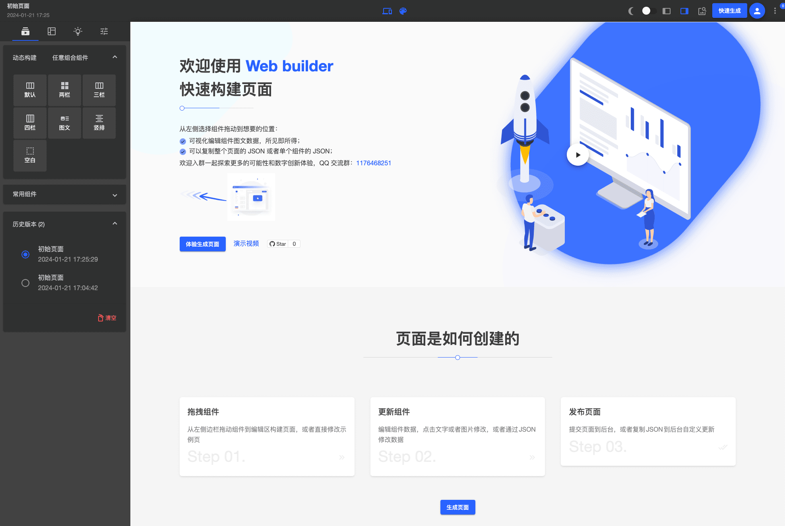

<h1 align="center">信使 UI 低代码前端框架</h1>

<p align="center">
  
  <br>
  <i>信使 UI 是基于 Material 的 Angular 低代码前端框架，丰富的组件库可提供优秀的数字创新体验，<br>使用 Web Builder 可以通过拖拽快速构建响应式、多主题的 Web 页面。
    </i>
  <br>
</p>

<p align="center">
  <a href="https://www.zhaobg.com"><strong>https://www.zhaobg.com</strong></a>
  <br>
</p>

<p align="center">
  <a href="https://www.zhaobg.com/builder">Web Builder</a>
  ·
  <a href="https://ui.zhaobg.com">UI Storybook</a>
  ·
  <a href="https://www.zhihu.com/people/biaogebusy">知乎</a>
   ·
  <a href="./README-EN.md">English</a>
  <br>
  <br>
  <a href="https://www.bilibili.com/video/BV1ux4y197kc/?vd_source=f65b4e2d70ecc450290b6b1710c0ada5#reply998790468">观看演示视频</a>
</p>

<p align="center">
  
  <br>
  <br>
</p>

> 奥陌陌是已知的第一颗经过太阳系的星际天体，意为"远方信使"。

[](https://sonarcloud.io/summary/new_code?id=biaogebusy_xinshi-ui)

#### 开源目的

项目非常适合初学者学习或者进阶，它涵盖了绝大部分 Angular 技术知识点，但并不仅限于以下内容。

- 服务端渲染（SSR）
- 懒加载，Inject 依赖注入
- 路由守卫
- 请求拦截缓存
- 动态组件
- 动态表单
- 动态表格
- 多主题
- 自定义指令
- 自定义管道 pipe
- 自定义 icon
- 数据图表
- Rxjs
- flex layout
- Storybook
- Typescript
- Provider
- 地图应用
- 信使 UI 在 Drupal 前后端分离中的应用

## 技术选型

- 前端：Angular + Material + FlexLayout
- 动态表单：ngx-formly
- web 动画：gsap
- 图表：Echarts
- 视频：Video.js
- 文件生成：jspdf 生成 pdf，html2canvas 生成图像
- 编辑器：quill, ang-jsoneditor
- 幻灯片：swiper
- 字体图标：material design icons + 自定义 svg icon
- 加密：crypto-js
- 工具函数：lodash-es
- 测试预览：storybook
- web 服务：Nginx
- 后端：Drupal(推荐)，通过 Drupal 的 views 视图可灵活配置动态组件、动态 api；

## 开发指南

详情可查阅[开发指南](https://ui.zhaobg.com/?path=/docs/guide--page)

## 开发环境设置

```javascript
// src/environments/environment.ts
export const environment: IEnvironment = {
  apiUrl: "http://localhost:4200",
  production: false,
  site: "dist",
  port: 4200,
  cache: false,
  ssr: false,
  drupalProxy: false,
};
```

- apiUrl: 是整个应用的 Base api 参数；
- production: 为 false 时，页面的内容 api 将调用本地 json 文件，true 时将会调用`${this.apiUrl}/api/v1/landingPage?content=${this.pageUrl}`接口；
- site: prod 打包时生成的文件夹名称，此设置是为了生存多个站点项目；
- port: 自定义应用端口；
- cache: 是否开启 api 请求缓存；
- ssr: 是否使用 SSR 服务端渲染方式；
- drupalProxy: 对应后端为 drupal，统一使用 Drupal 来登录登出；

## 路由守卫配置

默认会读取 `/api/v1/config` 的全局配置信息，这里主要是查看该站点是否是开放还是需要登录的，文件路径`src/app/core/guards/auth.guard.ts`，本地开发时可注释掉大概 35 行`reture true；`；

## 代理

配置文件`config/proxy.config.js`，本地开发时，会根据对应的 api url 前缀进行代理转发，根据实际情况进行配置；

```javascript
const PROXY_CONFIG = [
  {
    context: ["/api", "/user", "/sites"],
    target: "https://yourdomain.com",
    secure: false,
    changeOrigin: true,
  },
];

module.exports = PROXY_CONFIG;
```

## 运行

`npm start`

## 路由页面

- 默认首页：[http://localhost:4200/home](http://localhost:4200/home)
- 用户登录：[http://localhost:4200/me/login](http://localhost:4200/me/login)
- Web builder: [http://localhost:4200/builder](http://localhost:4200/builder)
- Drupal 媒体：[http://localhost:4200/media](http://localhost:4200/media)
- Drupal 区块：[http://localhost:4200/block](http://localhost:4200/block)

## 其他页面

除了以上路由页面，其他页面在访问时，会获取`url`进行接口的数据读取，进而渲染页面，本地环境和生产环境返回会了方便测试做了判断：

```javascript
loadPageContent(pageUrl = this.pageUrl): Observable<IPage> {
    if (environment.production) {
      const landingPath = '/api/v1/landingPage?content=';
      const pageUrlParams = `${this.apiUrl}${landingPath}${pageUrl}`;

      return this.http.get<any>(pageUrlParams).pipe(
        tap((page) => {
          this.updatePage(page);
        }),
        catchError(() => {
          return this.http.get<any>(`${this.apiUrl}${landingPath}404`);
        })
      );
    } else {
      const sample = pageUrl.split('/')[1];
      const samplePage = samples.elements.filter(
        (item) => item.id === sample
      )[0];
      if (samplePage) {
        this.updatePage(samplePage.page);
        return of(samplePage.page);
      } else {
        return this.http.get<any>(`${this.apiUrl}/assets/app/404.json`);
      }
    }
  }
```

Base 的基础配置可查阅[信使 storybook 全局配置](https://ui.zhaobg.com/?path=/docs/base-config--page)

## 为生产环境打包

`npm run build:ssr`

## 运行 Storybook

`npm run storybook`

如果有提示内存不足的报错，执行以下命令，然后重新运行:

`export NODE_OPTIONS="--max-old-space-size=8192"`

## 交流学习

| 联系                   | 二维码                                               |
| ---------------------- | ---------------------------------------------------- |
| 公众号：Drupal 自习室  |    |
| 交流加微信：biaogebusy |  |
