<p align="center">

</p>
<h1 align="center">信使 Web builder<br>AI 生成UI和工具应用的低代码平台</h1>

<p align="center">
  <br>
  <i>AI 生成UI和工具应用的低代码平台，国内首款开源的基于 Drupal 作为 Headless 的低代码，基于 TailwindCss，通过拖拽可视化快速构建现代化响应式UI、动态自定义组件、多主题、多语言的网站应用。AI-powered UI generation and publishing low code platform, built on TailwindCSS, enabling rapid drag-and-drop visual creation of modern responsive UIs, dynamic customizable components, multi-theme, and multi-language web applications.
    </i>
  <br>
</p>

<p align="center">
  <a href="https://builder.design"><strong>https://builder.design</strong></a>
  <br>
</p>

<p align="center">
  <a href="https://github.com/biaogebusy/builder-cms">Builder CMS</a>
  ·
  <a href="https://github.com/biaogebusy/xinshi-mini">信使小程序</a>
  ·
  <a href="https://docs.builder.design"> 文档 </a>
  ·
  <a href="https://www.zhihu.com/people/biaogebusy"> 知乎 </a>
   ·
  <a href="https://github.com/biaogebusy/builder-docker"> Docker 部署</a>
  <br>
  <br>
  <a href="https://space.bilibili.com/457248997/lists/2430152?type=season">观看演示视频</a>
</p>

<p align="center">
  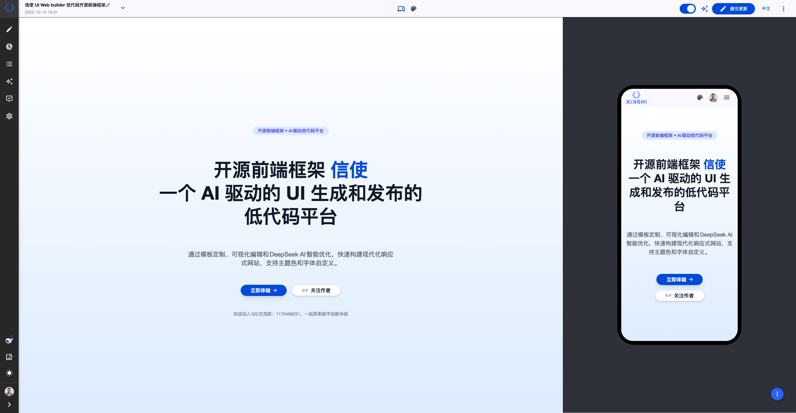
  <br>
  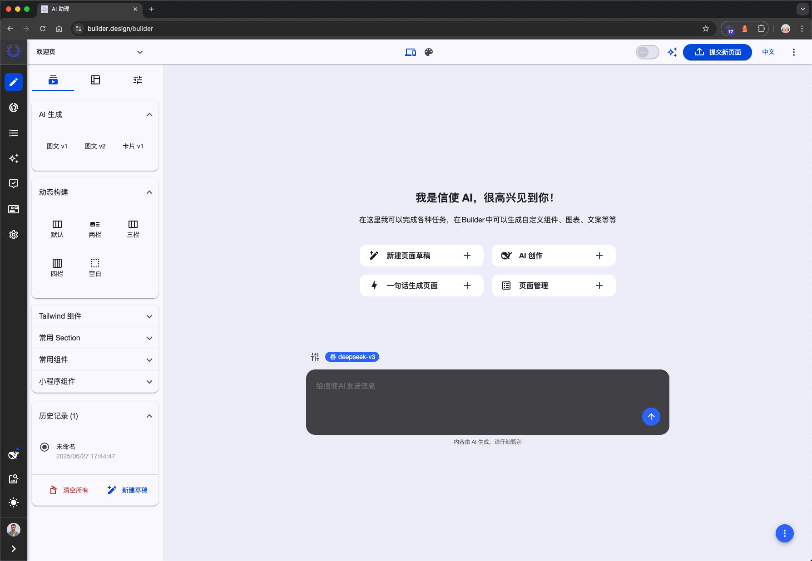
  <br>
  <br>
</p>

> 奥陌陌是已知的第一颗经过太阳系的星际天体，意为"远方信使"。

## web builder

| 功能点               | 说明                                                                  |
| -------------------- | --------------------------------------------------------------------- |
| Layout builder       | 动态 layout，基于 TailwindCss 的动态组件，支持静态数据和 API 数据来源 |
| 组件编辑             | 删除、复制 JSON、编辑组件数据、拖动上下排列                           |
| 媒体库               | 可在前台批量上传、查看、更新媒体库                                    |
| 小程序数据维护       | 通过 builder 管理小程序的页面和组件                                   |
| 页面历史版本         | 当提交、清空、加载示例等覆盖操作时新增历史版本                        |
| 草稿检测             | 当前内容有最新时，提醒是否拉取最新                                    |
| 丰富的模板库、示例库 | 基于模板库选择模板，快速生成页面                                      |
| 复制整个页面的 JSON  | 可直接复制 json，部署到后台发布                                       |
| 动画                 | 支持通用的AOS页面滚动动画和高细粒度的GSAP动画                         |
| 切换全宽             | 方便大屏编辑，减少干扰                                                |
| 快速生成页面         | 根据一定的规则从组件库中生成页面                                      |
| 多主题切换预览       | 预览在多主题下的组件显示情况                                          |
| 暗黑风格             | 支持切换浅色风格和暗黑风格，专注内容创作                              |
| 页面预览             | 调转到新窗口查看真实的页面                                            |
| 响应式预览           | 可切换不同设备尺寸查看页面响应式排版                                  |

## Builder 预览

|                                                      |                                                     |
| ---------------------------------------------------- | --------------------------------------------------- |
| 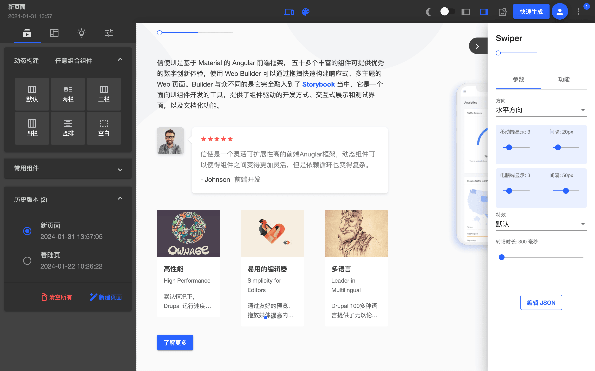  | 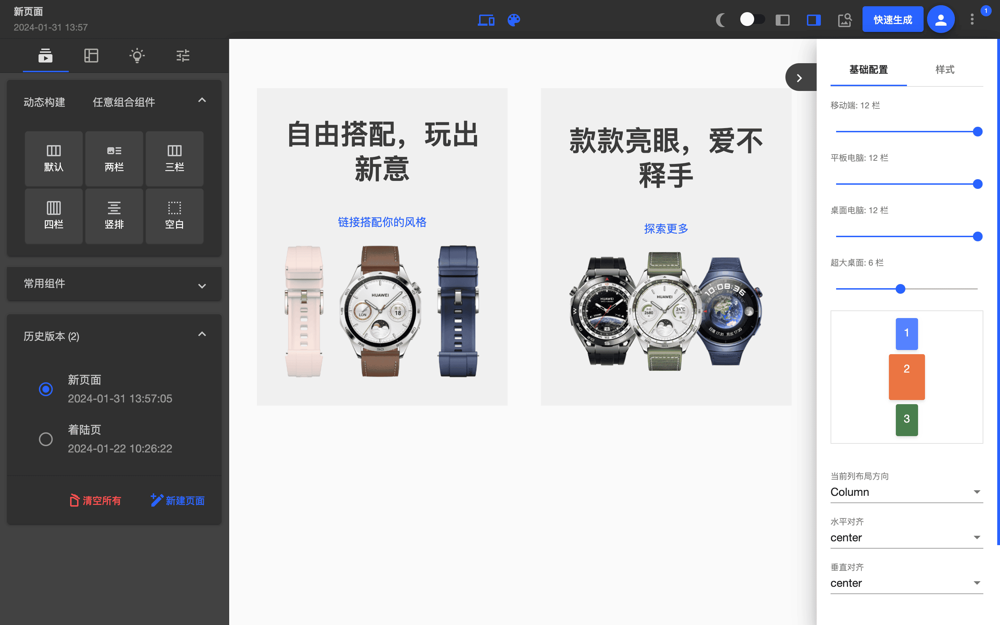 |
|    | 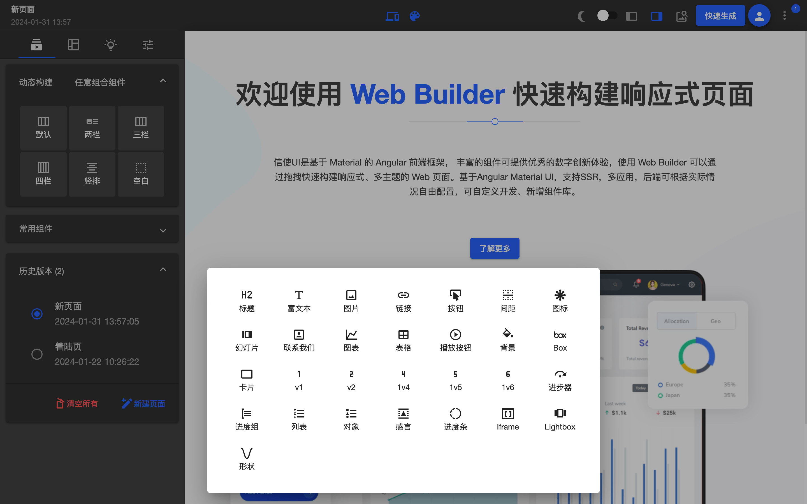 |
| 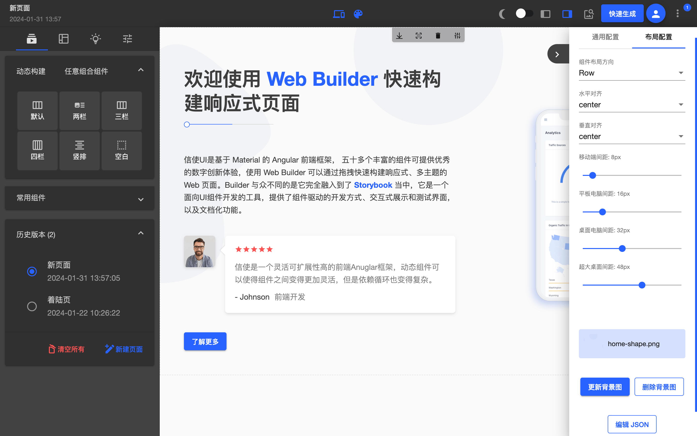 |  |
|   | 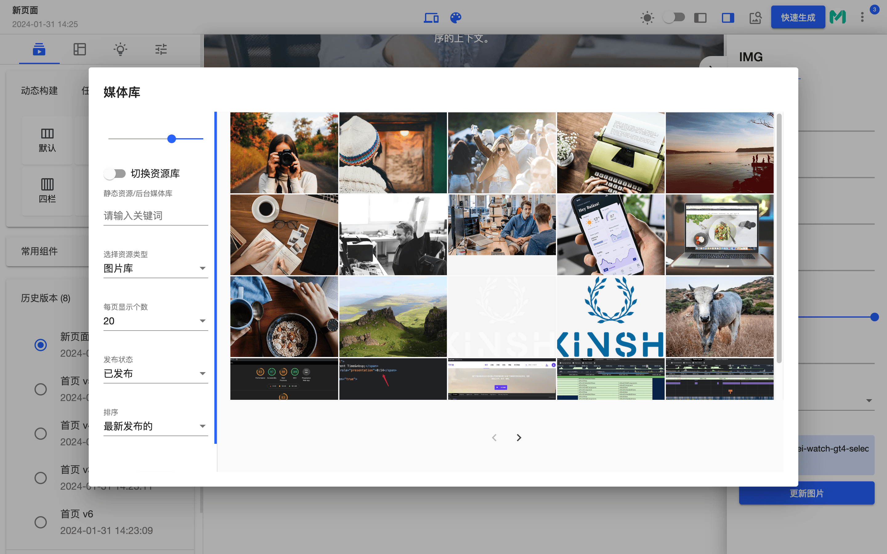 |

## Builder Pro 预览

> 基于AI大模型生成UI、页面和工具应用，欢迎体验。

|                                                         |                                                               |
| ------------------------------------------------------- | ------------------------------------------------------------- |
| 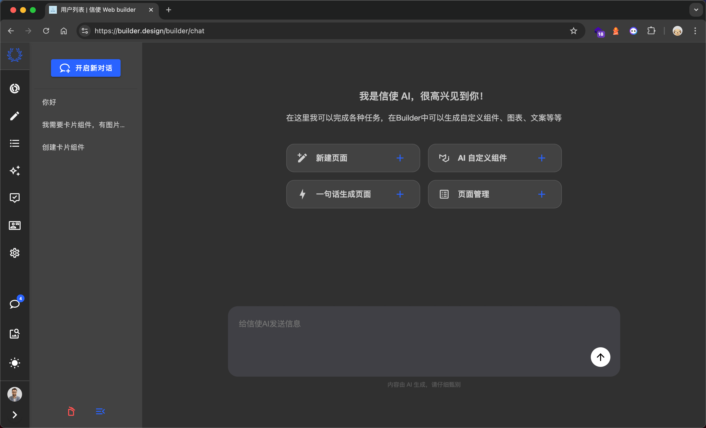 | 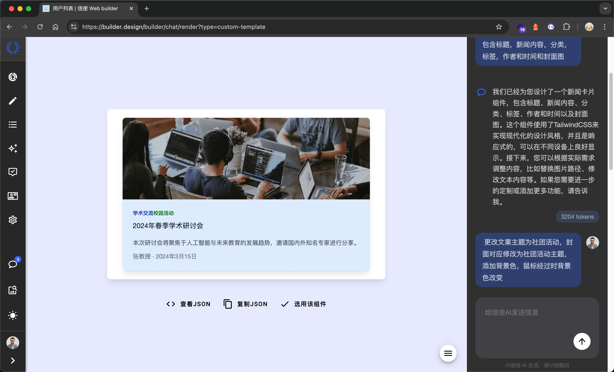 |
| 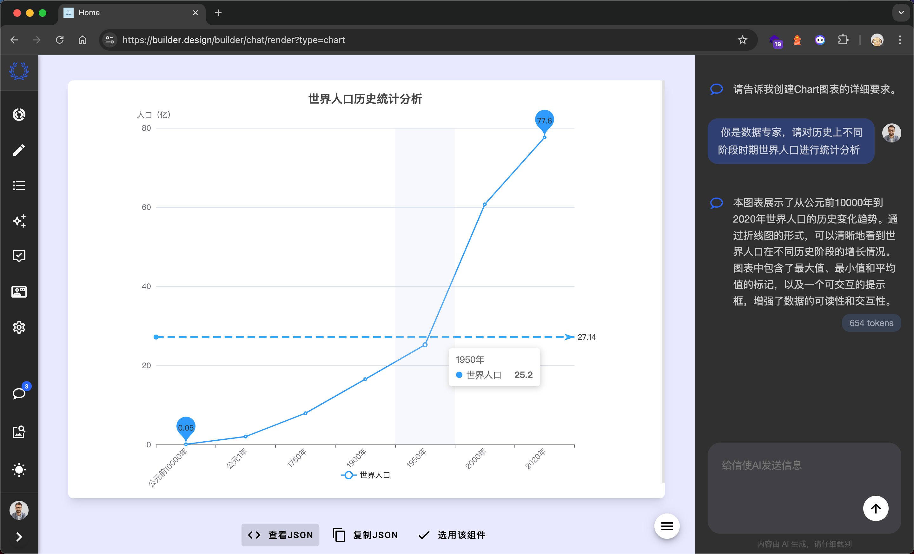 | 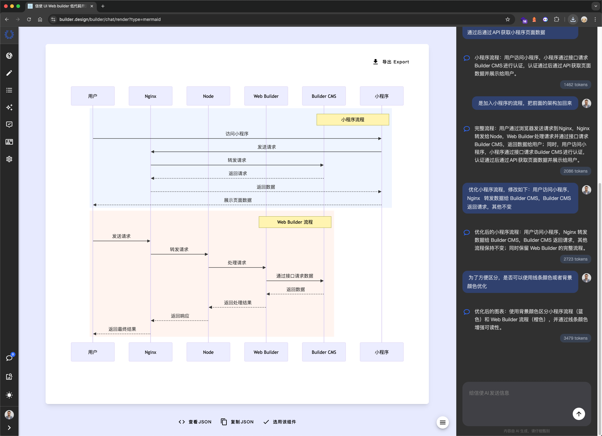   |

## 信使 Mini 小程序

<p align="center">
  <i>信使小程序是基于 Taro+NutUI 的小程序，Vue3拥有更好的编辑开发体验，<br>在<strong>Web builder</strong>中通过拖拽可视化配置，小程序可动态构建页面。
    </i>
  <br>
  <a href="https://github.com/biaogebusy/xinshi-mini">Github 开源地址</a>
</p>

<p align="center">
  
</p>

## 相关视频演示

- [DeepSeek 生成自定义组件](https://www.bilibili.com/video/BV1Xx9rYyEfK/)
- [AI 创建自定义组件，优化文案，一句话生成整个页面](https://www.bilibili.com/video/BV17HfhYKEMz/)
- [构建Drupal CMS 预览版宣传着陆页](https://www.bilibili.com/video/BV1mD6hY6Et3/)
- [支持AOS通用页面滚动动画](https://www.bilibili.com/video/BV1VKkSY3E1r/)
- [Layout 嵌套](https://www.bilibili.com/video/BV1pH4y1L7qk)
- [API 数据来源](https://www.bilibili.com/video/BV1ux4y1n7MA/) | [静态数据来源](https://www.bilibili.com/video/BV1rf421R7He/) TailwindCss 自定义组件
- [复制功能快速构建组件](https://www.bilibili.com/video/BV1nF4m1w7cs/)
- [多语言发布及媒体库管理](https://www.bilibili.com/video/BV1XohfeoEtz/)
- [自定义示例和模板库](https://www.bilibili.com/video/BV1wExPeBEdn)

<p>
  
  <p>微信扫码查看更多视频</p>
</p>

## 对应版本

| Web builder | Angular | Node     | TS     |
| :---------- | :------ | :------- | :----- |
| v11         | v20     | v22+     | v5.8+  |
| v10         | v19     | v18+     | v5.5+  |
| v9          | v18     | v18+     | v5.4   |
| v8          | v17     | v18+     | v5.2   |
| v7          | v16     | v16+     | v4.9.3 |
| v6          | v14     | v14.15.0 | v4.6   |
| v5          | v12     | v14      | v4     |
| <=v4        | v11     | v14      | v4     |

## 技术选型

- 前端：Angular 20 (standalone components、signals、zoneless change detection、incremental hydration) + Angular Material + TailwindCss
- SSR：@angular/ssr + Express
- 动态表单：ngx-formly
- web 动画：aos 页面滚动动画，gsap 细粒度定制化动画
- 图表：Echarts
- 视频：Video.js
- 日历：FullCalendar
- 编辑器：quill, jsoneditor, monaco-editor
- 幻灯片：swiper
- 图片画廊：lightgallery
- 字体图标：material design icons + 自定义 svg icon
- 加密：crypto-js
- 工具函数：lodash-es、dayjs
- Drupal JSON:API 查询：drupal-jsonapi-params
- 认证：OAuth2 (Drupal simple_oauth)
- web 服务：Nginx
- 后端：Drupal(推荐)，通过 Drupal 的 views 视图可灵活配置动态组件、动态 api；

## 开发指南

## 安装 npm install

1. 代码下载或者 clone 项目到本地：`git clone git@github.com:biaogebusy/web-builder.git`
2. 请使用 npm install 安装，严格按照 package-lock.json 锁版本安装，依赖较多，请多等待，使用 yarn 或者 pnpm 会有报错；

## 常用命令

- `npm start` — 本地开发服务（自动通过 `config/proxy.config.js` 代理 API 到 `https://base.builder.design`）
- `npm run build` — 生产环境打包（`ng build --configuration production`）
- `npm test` — 单元测试（Karma + Jasmine）
- `npm run lint` — ESLint 代码检查（flat config）
- `npm run e2e` — 端到端测试（Protractor）
- `npm run serve:ssr:xinshi` — 运行 SSR 构建产物（`node dist/server/server.mjs`）

提交时 husky 会触发 `lint-staged`，自动用 ESLint 修复 `*.ts`/`*.html`，并用 Prettier 格式化 `*.md`。

## 开发环境设置

```typescript
// src/environments/environment.ts
export const environment: IEnvironment = {
  apiUrl: 'http://localhost:4200',
  production: true,
  port: 4200,
  multiLang: true,
  langs: [
    {
      label: '中文',
      langCode: 'zh-hans',
      prefix: '/',
      default: true,
    },
    {
      label: 'EN',
      langCode: 'en',
      prefix: '/en',
    },
  ],
  oauth: {
    clientId: 'pd1DDpR9atXvciFn3Wt7jLsCweLXv0JCC8k1-9XNJTw',
    tokenUrl: '/oauth/token',
    authorizeUrl: '/oauth/authorize',
    redirectPath: '/me/login/callback',
    logoutPath: '/user/logout',
    scope: 'webmaster',
  },
};
```

- apiUrl: 整个应用的 Base api 参数；
- production: 为 false 时页面内容 api 调用本地 json 文件，true 时调用线上接口；
- port: 自定义 Node 端口；
- multiLang / langs: 多语言开关及前缀路由配置；
- oauth: 基于 Drupal simple_oauth 的 OAuth2 认证配置（授权码模式）。

## 本地开发环境 Proxy 代理

为了体验一致，本地默认配置体验站的 API 代理，配置文件 `config/proxy.config.js`，根据实际情况进行修改：

```javascript
const PROXY_CONFIG = [
  {
    context: [
      '/en/api',
      '/api',
      '/oauth',
      '/session',
      '/user',
      '/sites',
      '/admin',
      '/manage',
      '/system',
      '/core',
      '/libraries',
      '/modules',
      '/themes',
      '/webform_rest',
      '/media-library',
      '/views/ajax',
      '/editor',
      '/export',
      '/print',
      '/wechat',
      '/media',
      // ...更多 Drupal 路径
    ],
    target: 'https://base.builder.design',
    secure: false,
    changeOrigin: true,
  },
];

module.exports = PROXY_CONFIG;
```

## 为生产环境打包

`npm run build`

## 最后

- QQ 交流群：1176468251
- 感谢 [LINUX DO](https://linux.do/) 的支持
- 如果觉得这个项目对您有所助益，请帮忙点个 star

[](https://star-history.com/#biaogebusy/web-builder&Date)
